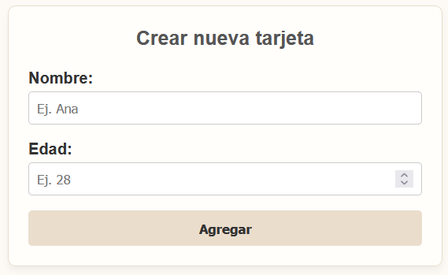
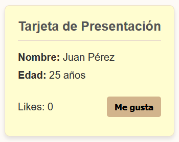

# Personal Information Card App

Welcome to the **Personal Information Card App**! This application is built using Angular and allows users to input personal information via a form and generates an aesthetically pleasing display card with their details.

## About the Project

This project serves as a showcase of fundamental Angular capabilities, focusing on:
- **Component Architecture:** Creating reusable UI components.
- **Data Binding:** Using `@Input` to pass data between components seamlessly.
- **Event Handling:** Capturing user interactions using event binding (e.g., a "like" counter).
- **Interpolation:** Displaying dynamic user data automatically on the screen.

### How it Works
1. The user fills out a simple form entering their details.
2. Upon submission, a beautifully styled cream-colored presentation card is generated.
3. The card features the user's name, age, and a functional "Like" button with a real-time counter!

## Screenshots

Here is the application in action:

### 1. New Card Form


### 2. Displayed Card


---


## Getting Started 

### Prerequisites
- [Node.js](https://nodejs.org/en/) (v18+)
- [Angular CLI](https://angular.io/cli)

### Installation

1. Clone the repository:
```bash
git clone https://github.com/JoyMoGas/AngularComponent.git
```

2. Navigate into the project directory:
```bash
cd mi-app
```

3. Install the dependencies:
```bash
npm install
```

4. Run the development server:
```bash
npm run start
```
The application will be available at `http://localhost:4200/`.